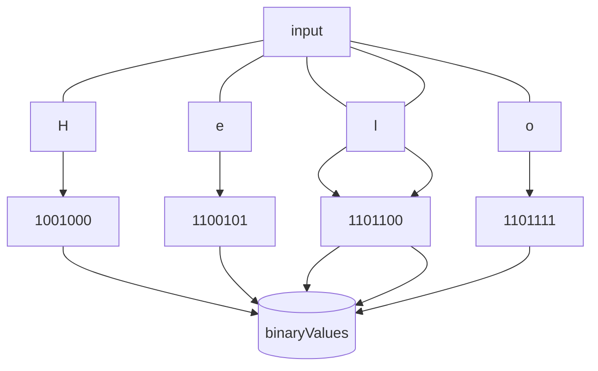
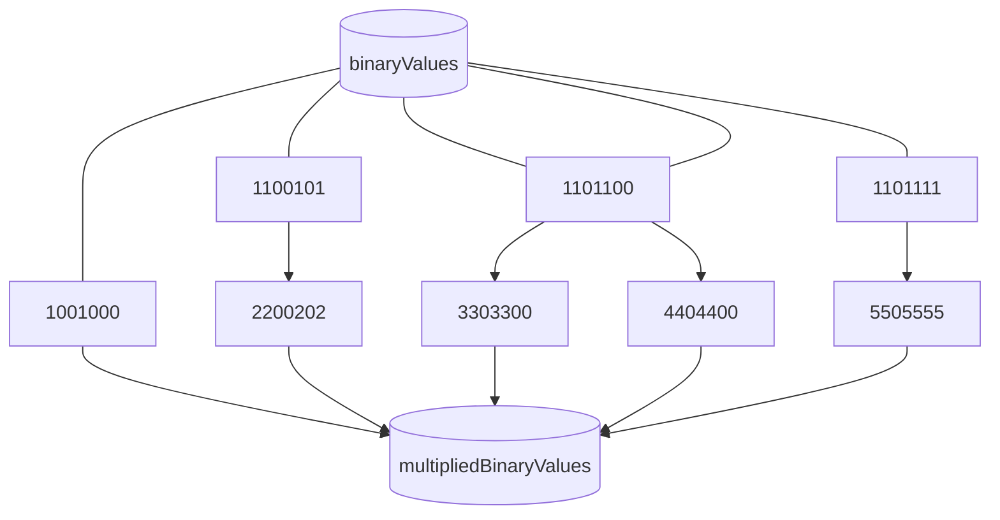
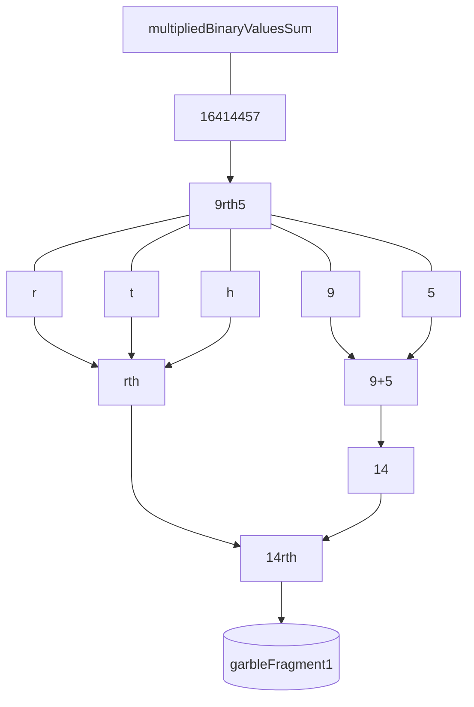
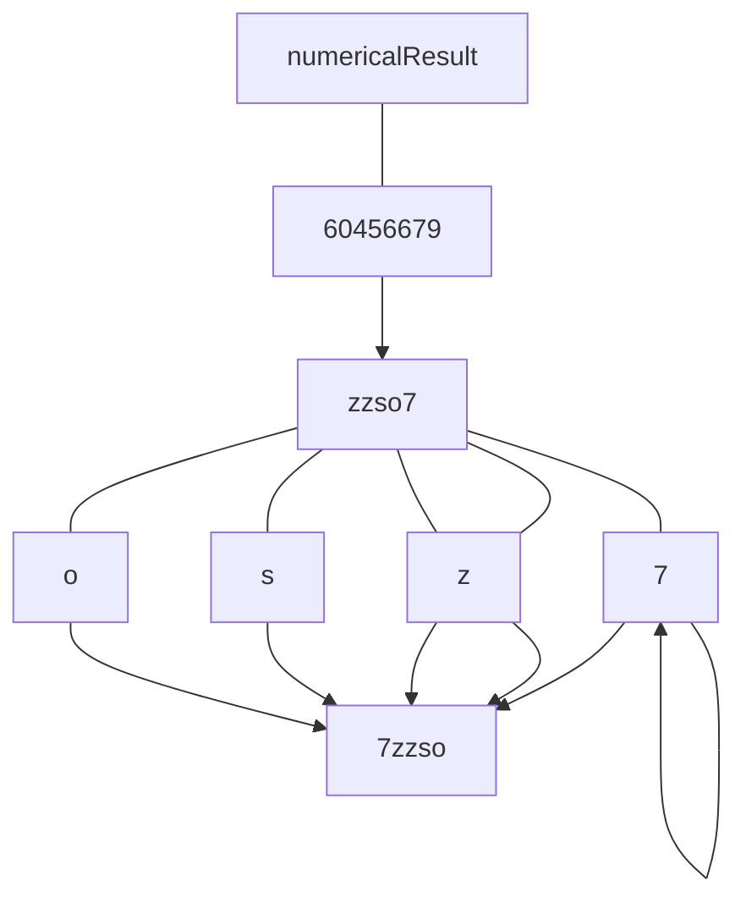
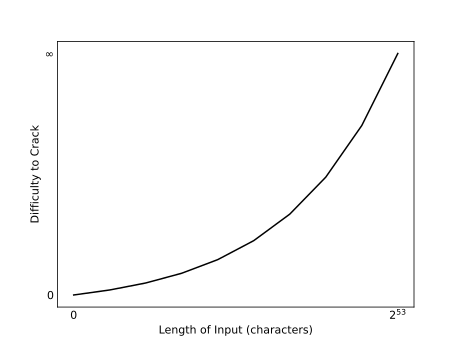

<div style="line-height: 170%">

<h1 align="center">Numerical Hashing Algorithm</h1>

<h3 align="center">A small client-side JavaScript encryption experiment</h3>

<h5 align="center">Drew Markel</h5>

<h6 style="font-size: 0.8em" align="center">Updated: 3/19/21</h6>

<style>

    .figure {
        margin: 10px 0px 10px 0px;
    }

    .label-container {
        fill: white !important;
        stroke: black !important;
    }

</style>

## Introduction

Just a small experiment of client-side JavaScript based encryption.

## Process

This section will use the string input of "Hello" (without quotes) to demonstrate the process of the Numerical Hashing Algorithm (NHA).

### Binary Conversion

The input is taken and each character is converted to binary and stored in an array called `binaryValues`.

<div align="center">



</div>

<figcaption align="center">Figure 1: Chart demonstrating the individual characters of the original input being converted into binary and stored into <code>binaryValues</code>.</figcaption>

<div class="figure" align="center">

`[1101000, 1100101, 1101100, 1101100, 1101111]`

</div>

<figcaption align="center">Raw 1: Output of converting all characters in the input to binary.</figcaption>

### Binary Value Manipulation

The values from `binaryValues` are now each taken and multiplied by their index plus one and stored in a new array called `multipliedBinaryValues`.

<div align="center">



</div>

<figcaption align="center">Figure 2: Chart demonstrating the values of <code>binaryValues</code> being multiplied by their index plus one. Note: Numbers are in front of the binary value to better keep track of their index and numbers in front of the characters show the index plus one being multiplied. They are purely for visualization.</figcaption>

$$\sum_{n=1}^{c}xn$$
<figcaption align="center">Equation 1: Formula for calculating values that will be stored in

`multipliedBinaryValues`

$c = $ `inputLength` $x = $ `item in binaryValues`.

</figcaption>

<div class="figure" align="center">

`[1101000, 2200202, 3303300, 4404400, 5505555]`

</div>

<figcaption align="center">Raw 2: Output of multiplying each value in <code>binaryValues</code> by their index plus one.</figcaption>

### Garble Generation

The garble is generated at this stage. The garble comprises the majority of the encryption and confusion aspect of the output making it harder to crack.

#### Fragment 1

Once all manipulated binary values have been stored in the `multipliedBinaryValues` array, they are then summed together to create the `multipliedBinaryValuesSum` variable. The value of `multipliedBinaryValueSum` is then base36 encoded and any numbers in the encoding are summed, while the remaining letters are grouped together both of which are stored in an array that is returned when `garbleFragement1()` is called.

<div align="center">



</div>

<figcaption align="center">
Figure 3: Diagram showing the process of calculating

`garbleFragement1()`.
</figcaption>

#### Fragment 2

The second fragment of the garble is generated via two parts. The first part takes the values of `multipliedBinaryValues` sorts them in numerical order, then  multiplies them by their index plus one. They are then all summed together into a variable called `numericalResult`. The second part of the process encodes `numericalResult` into base36 and any numbers are summed together while any letters are grouped together and both are stored in an array that is returned when `garbleFragment2()` is called.

<div align="center">



</div>

<figcaption align="center">
Figure 4: Diagram showing the process of calculating

`garbleFragement2()`.
</figcaption>

$$\sum_{n=1}^{c}xn$$
<figcaption align="center">Equation 2: Formula for calculating

`numericalResult` variable

$c = $ `inputLength` $x = $ `item in multipliedBinaryValue`.

</figcaption>

$$21rthzzso$$
<figcaption align="center">
Raw 3: Output of the garble generation formula for the input.
</figcaption>

### Finalization

The final process is simple; the garble is sorted numerically and alphabeticially.

$$12horstzz$$

<figcaption align="center">
Raw 4: Output of sorting the garble numerically and alphabetically.
</figcaption>

## Speed(s)

<figcaption align="center">
Table 1: Time taken to encrypt "Hello" over several iterations.
</figcaption>

 | Iterations | Speed (ms) |
 | :--------: | :--------: |
 |     1      |   ~0.23    |
 |     10     |   ~0.41    |
 |    100     |   ~1.54    |
 |    1000    |   ~13.30   |
 |   10000    |  ~465.33   |
 |   100000   |  ~475.00   |
 |  1000000   |  ~4458.58  |

## Usage

```js
import NHA from 'Numerical-Hashing-Algorithm'

NHA("Hello")
```

Usage is simple, just import as an ES6 module and call the function with the desired input to be encrypted as the only parameter. The algorithm will encrypt the input and return it using `return`.

## Caveats

### Version Differences

When compared to a Python prototype, the JavaScript version is not as accurate mathematically which means hash values could slightly change between different versions of JavaScript. This means that both the client and server need to have an updated browser and JavaScript version or must be both on the same version of JavaScript.

### Weaknesses

Considering the fact that the algorithm is purely based on basic mathematical principles and only uses base 10 numbers to encrypt, it may not be as secure as SHA256, SHA512, or some other big names in cryptography. If an attacker knows the exact length of the orignal unencrypted input, they would have a significant advantage in cracking the encryption.

### Limitation(s)

One glaring limitation is JavaScript's inability to process numbers larger than $2^{53}$ which would limit the amount of characters that can be entered for encryption.

## Security

As with most encryption, and similar to passwords, the longer the input, the better the encryption. NHA is no different.

<div align="center">



</div>

<figcaption align="center">
Figure 4: Graph showing difficulty of encryption as the length of the input increases where

$2^{53}$
is the JavaScript integer limit.
</figcaption>

</div>
